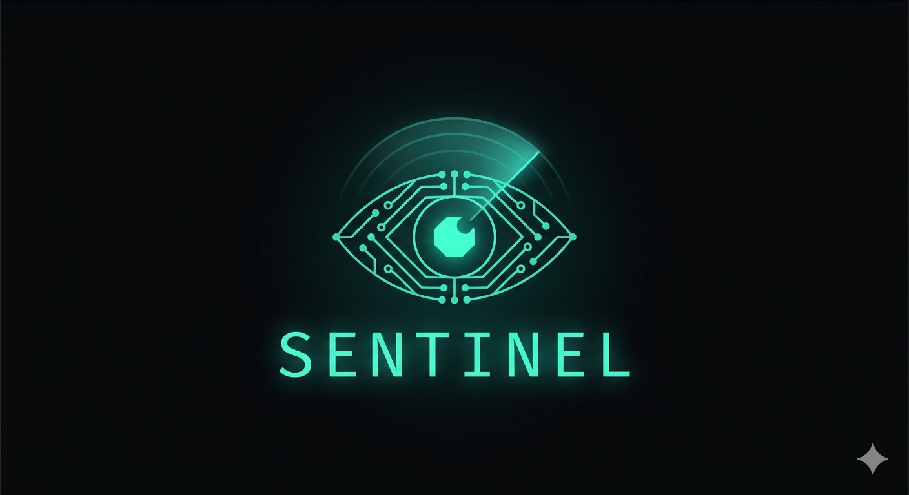

<div align="center">



# Sentinel

*AI-powered attack surface monitoring, dependency risk scoring, and authorization flaw detection — in one pipeline.*

[](https://github.com/angadjosan/sentinel/actions/workflows/ci.yml)
[](./LICENSE)
[](https://www.python.org/downloads/)
[](https://github.com/angadjosan/sentinel/pulls)

</div>

**Get started in 30 seconds:**

```bash
pip install sentinel-sec
sentinel scan --repo https://github.com/your-org/your-public-repo
```

You only need **`--domain`** when you want attack-surface enumeration (Subfinder/Shodan) seeded off a hostname you care about (e.g. `your-app.com`). Dependency + auth stages run from the repo alone. Add `--domain` for full three-stage coverage when you know production’s registrable domain.

By default this prints a **Rich** summary in your terminal, writes findings to disk, and **starts the local dashboard** (browser opens when `auto_open` is true in config). Use `--quiet` for CI or headless runs (artifacts only, no terminal UI, no dashboard). You can still run `sentinel dashboard` later against the same report directory.

**Hosted vs local:** The [PRD](./PRD_TDD.md) requires a **GitHub App install** for the **cloud** product (webhooks, org automation). The **CLI** can scan any **public** repo URL without that install; private repos need a normal GitHub token on your machine.

---

<div align="center">

<!-- TODO: record terminal GIF and save to ./assets/demo-cli.gif -->


*CLI scan output — attack surface, deps, and auth flaws in under 60 seconds.*

<!-- TODO: screenshot the dashboard and save to ./assets/demo-dashboard.png -->


*Web dashboard — unified findings triage across all three scan stages.*

</div>

---

## Contents

- [Why Sentinel](#why-sentinel)
- [How It Works](#how-it-works)
- [Features](#features)
- [CLI Reference](#cli-reference)
- [Dashboard](#dashboard)
- [Quickstart](#quickstart)
- [Configuration](#configuration)
- [Environment variables](#environment-variables)
- [Architecture](#architecture)
- [Threat Model](#threat-model)
- [Roadmap](#roadmap)
- [Contributing](#contributing)
- [License](#license)

---

## Why Sentinel

As AI writes more code faster, security teams can't keep up with manual review. Traditional SAST tools catch syntax-level bugs but miss logic flaws like broken access control — the kind that let an attacker read another user's data by changing a single ID in a URL. The volume of code is outpacing the capacity to reason about it safely.

The insight behind Sentinel is that attack surface, dependency risk, and authorization logic flaws are three angles on the same question: *what can an attacker actually reach and exploit?* Most tools answer only one. Dependency scanners flag thousands of CVEs without knowing whether the vulnerable code is even reachable. Attack surface tools have no idea what the codebase looks like. Code reviewers check auth patterns file by file, without tracing the full middleware chain. Sentinel runs all three in one pipeline and gives you a unified view.

**CLI-native:** `sentinel scan` is the main entrypoint. You get the same run documented in the terminal *and* in the web UI by default — no separate “run scan, then remember to open the dashboard” step unless you opt out.

**LLM-native:** Auth-stage results are written for both people and tools: the CLI surfaces route, severity, location, and a short natural-language rationale so you (or an agent reading CI logs) can judge risk without digging through raw JSON. Full detail stays in `findings.json` and the dashboard.

Sentinel is an open-source tool for small engineering teams, individual security researchers, and OSS maintainers who want serious coverage without an enterprise contract. It runs locally, deploys to your own infra, and sends nothing anywhere you haven't explicitly configured.

---

## How It Works

Sentinel is a three-stage pipeline — each stage answers a different question about what an attacker could reach and exploit.

| Stage | What it does | Key output |
|---|---|---|
| 1. Attack Surface | Enumerates subdomains, open ports, TLS config, and dangling DNS for the target domain | List of exposed endpoints + misconfig warnings |
| 2. Dependency Risk | Scores every package in the repo by reachability + CVE severity + patch cadence + transitive exposure | Risk-ranked dependency report |
| 3. Auth Review | LLM reviews new code for API routes missing auth middleware, IDOR patterns, and privilege escalation paths | Annotated findings with severity and CWE ID |

*All three stages share a unified findings format. A normal `sentinel scan` shows triage-friendly output in **both** the terminal and the dashboard; use `--quiet` when you only want files and exit codes (e.g. GitHub Actions).*

---

## Features

- **Attack surface enumeration** — uses Subfinder and Shodan to map what's actually exposed on the internet for a given domain.
- **Reachability-aware dep scoring** — checks whether vulnerable functions in dependencies are actually called in your code, not just present.
- **AI authorization auditing** — uses an LLM to reason about whether new API routes are gated by your existing auth middleware.
- **Unified findings output** — all results share a single JSON schema so they can be piped into Slack, GitHub Issues, or your SIEM.
- **CLI + dashboard in one scan** — default `sentinel scan` streams Rich terminal output and spins up the local dashboard against the report it just wrote; `--quiet` turns that off for CI.
- **Web dashboard** — same local UI for deep triage (filters, CWE, evidence, annotations); also available standalone via `sentinel dashboard`.
- **GitHub integration** — optional [GitHub Actions workflow](.github/workflows/sentinel.yml) for PR/CI scans today; the [product PRD](./PRD_TDD.md) targets a **GitHub App** (webhooks, Check Runs, org-wide install) as the primary integration so teams do not need a workflow file per repo.
- **Self-hostable** — no data leaves your environment; bring your own LLM API key.

---

## CLI Reference

All Sentinel functionality is accessible via the `sentinel` CLI.

### `sentinel scan`

Runs a full scan (all three stages by default) against a repo. **Attack surface** needs either an explicit **`--domain`** seed or enough hints in the repo for Sentinel to infer domains; **dependency** and **auth** stages only need the repo.

**Default behavior:** Rich progress and summary tables on stdout (including short LLM rationales for auth findings), artifacts written under `--output`, and the **local dashboard** started in the background loading that report (browser opens when enabled in config). **`--quiet` (`-q`)** skips terminal UI and does not start the dashboard — use in CI or when only files matter. **`--no-dashboard`** keeps full CLI output but does not start the dashboard.

```bash
sentinel scan [flags]
```

| Flag | Type | Default | Description |
|---|---|---|---|
| `--repo` | string | — | GitHub repo URL to scan (required) |
| `--domain` | string | — | Optional seed for attack-surface enumeration (registrable domain, e.g. `example.com`). If omitted, Sentinel derives candidates from the repo; surface may be sparse when nothing is found |
| `--stages` | string | `all` | Comma-separated stages to run: `surface,deps,auth` or `all` |
| `--config` | string | `./sentinel.yml` | Path to config file |
| `--output` | string | `./sentinel-report` | Directory to write findings to |
| `--format` | string | `json` | Output format: `json`, `html`, `markdown` |
| `--fail-on` | string | `high` | Exit with code 1 if findings at this severity or above are found |
| `--quiet` / `-q` | bool | `false` | Artifact-only mode: no Rich output, no auto-dashboard (errors to stderr) |
| `--no-dashboard` | bool | `false` | Full CLI output but do not auto-start the dashboard after the scan |

Example:

```bash
# Default: terminal + dashboard + JSON/HTML on disk (public repo is enough)
sentinel scan \
  --repo https://github.com/your-org/your-repo \
  --format html

# Full surface coverage when you know production domain
sentinel scan \
  --repo https://github.com/your-org/your-repo \
  --domain your-app.com \
  --format html

# CI: files and exit code only (set domain if you run attack-surface in CI)
sentinel scan \
  --repo https://github.com/your-org/your-repo \
  --domain your-app.com \
  --format html \
  --fail-on high \
  --quiet
```

---

### `sentinel dashboard`

Launches the local web dashboard to browse and triage findings from the most recent scan (or a specified report file).

```bash
sentinel dashboard [flags]
```

| Flag | Type | Default | Description |
|---|---|---|---|
| `--report` | string | `./sentinel-report` | Path to the findings directory or JSON file to load |
| `--port` | int | `4000` | Port to serve the dashboard on |
| `--open` | bool | `true` | Automatically open the dashboard in a browser |

Example:

```bash
sentinel dashboard --report ./sentinel-report --port 4000
```

---

### `sentinel report`

Converts an existing findings JSON file into a different output format without re-running a scan.

```bash
sentinel report [flags]
```

| Flag | Type | Default | Description |
|---|---|---|---|
| `--input` | string | `./sentinel-report/findings.json` | Path to findings JSON |
| `--format` | string | `html` | Output format: `html`, `markdown`, `sarif` |
| `--output` | string | `./report.html` | Output file path |

Example:

```bash
sentinel report --format sarif --output sentinel.sarif
```

---

### `sentinel diff`

Scans only the changed files in a PR or commit range rather than the full repo. Designed for use in CI where a full scan would be too slow.

```bash
sentinel diff [flags]
```

| Flag | Type | Default | Description |
|---|---|---|---|
| `--base` | string | `main` | Base branch or commit SHA to diff against |
| `--head` | string | `HEAD` | Head branch or commit SHA |
| `--repo` | string | — | GitHub repo URL (required) |
| `--fail-on` | string | `high` | Exit with code 1 if findings at this severity or above are found |
| `--quiet` / `-q` | bool | `false` | Same semantics as `sentinel scan --quiet` |

Example:

```bash
sentinel diff --base main --head feature/new-api-routes --repo https://github.com/your-org/your-repo
```

---

## Dashboard

After a normal `sentinel scan`, the dashboard is **started for you** (unless you passed `--quiet` or `--no-dashboard`). `sentinel dashboard` alone starts the same lightweight local server (default port 4000) for exploring findings from a previous run. It reads from the most recent `findings.json` in the output directory, or from a path you specify with `--report`.

The dashboard shows all findings unified across the three scan stages. You can filter by stage, severity (critical / high / medium / low / info), and finding type. Each finding shows the affected file or endpoint, the CWE ID where applicable, and the raw evidence — the code snippet or DNS record that triggered it. You can mark findings as resolved, false positive, or accepted risk; these annotations are saved back to the findings JSON so they persist across sessions.

<!-- TODO: screenshot the dashboard findings view and save to ./assets/dashboard-findings.png -->


*Findings view — filter by stage and severity, click any row to see the full evidence and remediation guidance.*

**Typical workflows:** interactive/local — run `sentinel scan` and triage in the terminal and/or the browser tab that opens. **CI** — use `sentinel scan --quiet` (or `sentinel diff --quiet`), upload `findings.json` as an artifact, then run `sentinel dashboard --report ./sentinel-report` locally to triage before filing GitHub issues.

---

## Quickstart

**Requirements:** Python **3.11+** (`requires-python` in [`pyproject.toml`](./pyproject.toml)). CI runs against **3.11 and 3.12**; use **3.12** for local dev if your machine still has an older system Python (for example macOS’s default 3.9.x).

**1. Install**

```bash
pip install sentinel-sec
```

**2. Set secrets in your shell (or CI)**

You **must** set an LLM key if the **auth review** stage runs (default full scan). Dependency + surface stages do not need it.

```bash
export ANTHROPIC_API_KEY=sk-...
# Or for OpenAI:
# export OPENAI_API_KEY=sk-...
# Optional: export SHODAN_API_KEY=...   # richer attack-surface / host intel
# Private repo: export GITHUB_TOKEN=...  # or use `gh auth login`
```

**3. Run a full scan**

```bash
sentinel scan --repo https://github.com/your-org/your-public-repo
# Optional: --domain your-app.com for stronger attack-surface seeding
# Terminal summary + findings on disk + local dashboard (see URL printed)
```

**4. (Optional) Open the dashboard only**

If you used `--quiet` earlier or want another port:

```bash
sentinel dashboard
# Opens http://localhost:4000 automatically when auto_open is true
```

**5. Export a report**

```bash
sentinel report --format html --output report.html
```

> **Tip:** To scan only changed files in a PR, use `sentinel diff` instead of `sentinel scan`. This is much faster in CI. Add `--quiet` in Actions to keep logs small.

> **Tip:** To use as a GitHub Action, see the [workflow template](.github/workflows/sentinel.yml) in this repo.

---

## Configuration

Sentinel is configured via a `sentinel.yml` file at the repo root.

```yaml
# sentinel.yml

target:
  repo: https://github.com/your-org/your-repo  # GitHub repo to scan
  # domain: your-app.com                        # Optional: attack-surface seed (omit → infer from repo)

stages:
  attack_surface: true   # Toggle Subfinder + Shodan enumeration
  dependency_risk: true  # Toggle reachability-aware dep scoring
  auth_review: true      # Toggle LLM auth analysis

llm:
  provider: anthropic    # anthropic | openai
  model: claude-sonnet-4-20250514

output:
  format: json           # json | html | markdown
  path: ./sentinel-report

scan:
  quiet: false           # Global default for artifact-only runs (CLI flag overrides)
  auto_dashboard: true   # Start dashboard after `sentinel scan` unless --quiet / --no-dashboard

dashboard:
  port: 4000             # Port for `sentinel dashboard` and post-scan auto-dashboard
  auto_open: true        # Open browser when the dashboard starts

thresholds:
  dep_risk_score: 7.0    # Fail CI if any dep scores above this (0–10)
  auth_severity: high    # Fail CI at this severity or above
```

---

## Environment variables

**You do not set the whole stack for a normal install.** It depends who you are:

| You are… | What to set |
|----------|-------------|
| **Using the hosted GitHub App** (e.g. sentinel.dev) | Usually **nothing**. Install the App in GitHub; the **operator** already configured server-side keys. |
| **Running `sentinel` locally or in CI** | Only what your run needs: **LLM key** if auth review runs (`ANTHROPIC_API_KEY` or `OPENAI_API_KEY`). Optional: `SHODAN_API_KEY`, `GITHUB_TOKEN` (private repos / rate limits). Put them in the shell, `.env` (if the CLI loads it), or GitHub Actions secrets — **never** in committed `sentinel.yml`. |
| **Self-hosting** the full API + workers | **All** of: GitHub App credentials, `DATABASE_URL`, `REDIS_URL`, LLM key, plus optional `SHODAN_API_KEY` and notification URLs. See the full matrix in [PRD §18 — Environment Variables](./PRD_TDD.md#environment-variables). |

**Minimum mental model:** LLM key **required** when the auth stage is on; everything else is optional or self-host-only.

---

## Architecture

Sentinel takes a **repo URL** (required) and an optional **domain seed** for attack-surface work, runs three analysis stages in parallel where possible, and merges all results into a unified findings object. **`sentinel scan` is CLI-first:** by default the same merged object is rendered as Rich terminal output *and* served by the auto-started local dashboard (`--quiet` opts out).

The diagram below matches the **CLI / CI** mental model (local scan + dashboard). The full hosted design — GitHub App, FastAPI API, Celery workers, PostgreSQL, Redis, and a deployed Next.js dashboard — is specified in [`PRD_TDD.md`](./PRD_TDD.md).

```
┌─────────────┐     ┌──────────────────────┐     ┌───────────────────┐     ┌─────────────────┐
│ GitHub Repo │────▶│ Stage 2: Dep Scorer  │────▶│                   │     │   CLI Output    │
└─────────────┘     └──────────────────────┘     │  Unified Findings │────▶│  (stdout/file)  │
                                                  │   (JSON schema)   │     └─────────────────┘
┌─────────────┐     ┌──────────────────────┐     │                   │
│Domain (opt.)│────▶│ Stage 1: Atk Surface │────▶│                   │     ┌─────────────────┐
└─────────────┘     └──────────────────────┘     │                   │────▶│  Web Dashboard  │
                                                  │                   │     │  (port 4000)    │
┌─────────────┐     ┌──────────────────────┐     │                   │     └─────────────────┘
│   PR Diff   │────▶│ Stage 3: Auth Review │────▶│                   │
└─────────────┘     └──────────────────────┘     └───────────────────┘
```

---

## Threat Model

Sentinel is designed to detect three categories of risk: exposed infrastructure (subdomains, open ports, dangling DNS, misconfigured TLS), vulnerable and reachable dependencies (packages with known CVEs where the vulnerable code path is actually called), and authorization logic flaws introduced at the code level (routes missing auth middleware, IDOR patterns, privilege escalation paths).

Sentinel is explicitly not a penetration testing tool, a WAF, or a runtime monitor. It operates at development time — before code ships — not in production. It does not exploit findings, send traffic to production systems, or perform active port scanning. All attack surface enumeration uses passive sources (Subfinder's certificate transparency and DNS data, Shodan's indexed results).

Sentinel reads repo contents and makes DNS and Shodan API queries. The auth review stage sends code snippets — specifically the diff and auth middleware context — to an external LLM API (Anthropic or OpenAI, per your config). Users should review the data-handling implications of this before scanning private repos. The LLM is never sent full repo contents, only the relevant diff and targeted context windows.

LLM-based auth review can produce false positives, particularly in codebases with non-standard middleware patterns. Findings should always be triaged by a human (using the dashboard or otherwise) before being treated as confirmed vulnerabilities. The reachability analysis is conservative by design — if in doubt, Sentinel will flag rather than suppress.

---

## Contributing

Contributions are welcome. The best way to start is to open an issue describing the bug or feature you have in mind before submitting a PR — this ensures the work aligns with the project direction and avoids duplicated effort.

See [CONTRIBUTING.md](./CONTRIBUTING.md) for detailed guidelines on setting up a dev environment, running tests, and the PR review process.

### Running tests locally

```bash
pip install -e ".[dev]"
pytest tests/ -v
```

---

## License

Sentinel is released under the [MIT License](./LICENSE).
