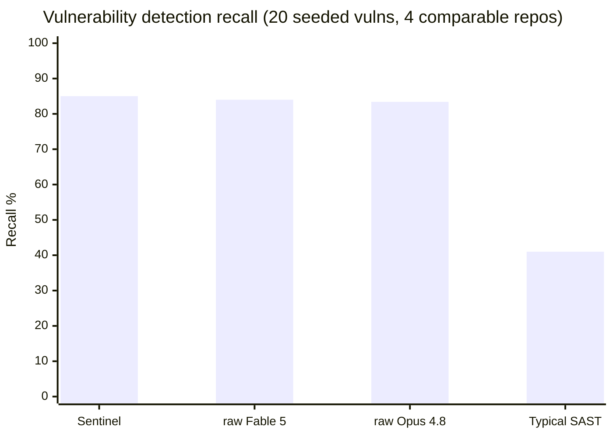
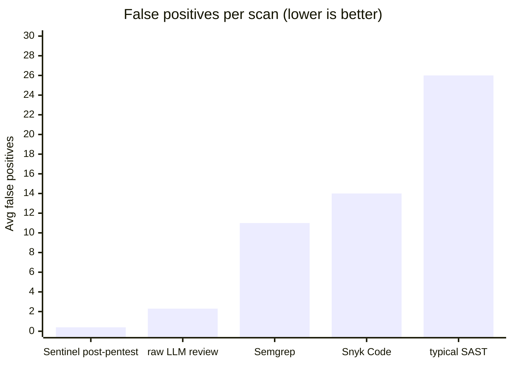
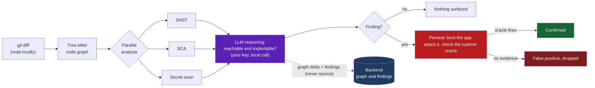
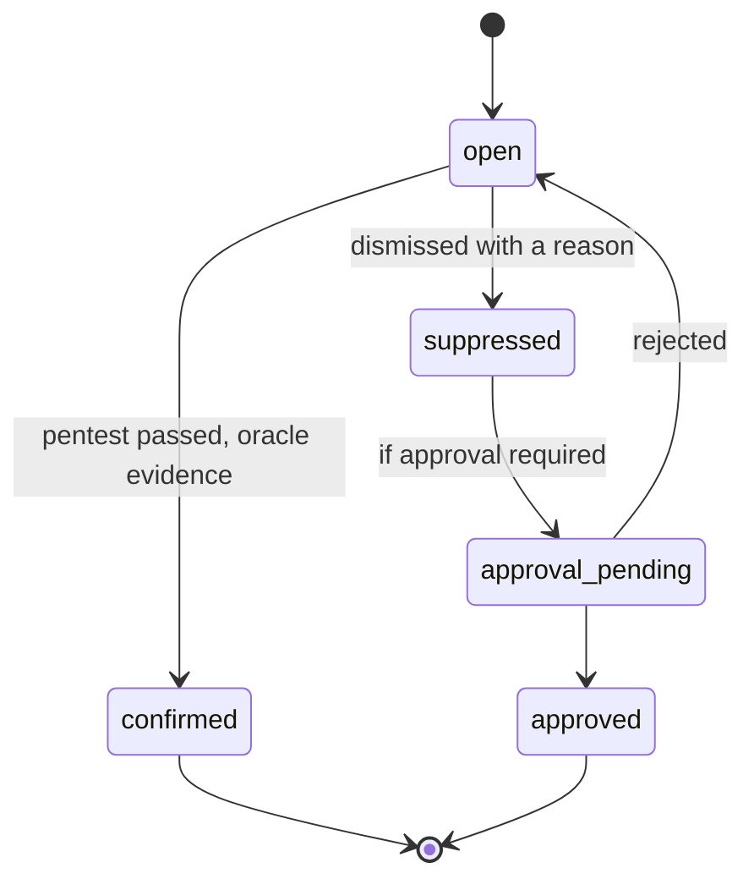
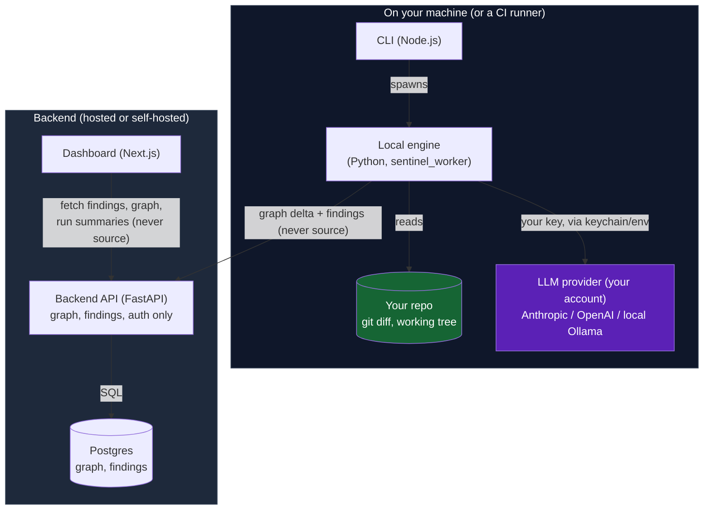

<div align="center">

# Sentinel

### An LLM-powered application security agent that finds real vulnerabilities and proves they're exploitable before it bothers you.

Sentinel reasons about exploitability on your actual diff, verifies each finding by attacking a running copy of your app, and never lets a line of your source code leave your machine.

<br/>

[](LICENSE)
[](https://www.npmjs.com/package/sentineldev)
[](https://pypi.org/project/sentinel-worker/)
[](https://github.com/marketplace/actions/sentinel)
[](https://nodejs.org)
[](#self-host-the-backend)
[](#contributing)

<br/>

[**Quickstart**](#quickstart) | [**How it works**](#how-it-works) | [**Benchmarks**](#benchmarks) | [**vs. the incumbents**](#how-sentinel-compares) | [**Self-host**](#self-host-the-backend) | [**CLI reference**](#cli-reference)

</div>

---

## Why Sentinel

Most of the AppSec stack, whether that's SAST, SCA, dependency bots, or the newer "AI security" add-ons, is really answering one question: does this code match a known-bad pattern? That approach has two problems baked in. It can only catch vulnerabilities it has already catalogued, and it drowns you in noise. You get "47 vulnerabilities," three of which actually matter. In practice, more than 85% of findings from traditional scanners turn out to be false positives ([Endor Labs](https://www.endorlabs.com/)), because a signature has no way of knowing whether a bug is actually reachable from attacker-controlled input.

Sentinel takes a different approach. It reasons about exploitability in context.

- **It reasons about exploitability.** Pattern matching is a cheap prior that tells you where to look. The real work is the layer that decides whether a finding is actually reachable and exploitable in this specific codebase, on this specific diff. That layer kills the false positives signatures over-flag, and it also surfaces novel bugs no signature describes.
- **It proves the bug before it pages you.** `sentinel pentest` boots a copy of your app and attacks it, confirming a finding with runtime evidence such as sanitizer output or behavioral proof. That closed exploit loop is something most commercial platforms don't even attempt.
- **Your source never leaves your machine.** Diffs are computed, read, and analyzed locally by an LLM you configure with your own key, or a local Ollama model if you prefer. Only the code graph (file and line pointers plus short semantic labels, never source text) and the findings sync to the cloud. Self-hosted SaaS competitors expect you to upload your entire codebase.
- **It's open source and multi-model.** Bring Anthropic, OpenAI, or a fully local model. No vendor lock-in, and no closed SaaS you can't inspect.

> The short version: turn tokens into security. Sentinel is the layer that answers "is my AI-generated code actually exploitable?" and then goes and proves it.

---

## Benchmarks

We seeded 25 real vulnerabilities across 5 production-shaped repositories (Next.js apps, a FastAPI service, a Python CLI, an Express web app) and measured detection against the same ground truth, using the same grading rubric, for every approach.

Sentinel leads on cumulative detection, and its pentest-verification layer drives false positives close to zero. That second number is the one that matters most once a human has to triage the output.



### Per-repository results

| Repository | Stack | Ground truth | Sentinel | raw Fable 5 | raw Opus 4.8 |
|---|---|:---:|:---:|:---:|:---:|
| `scams` | Next.js event registration | 5 | **5 / 5** | 84.0% | 88.0% |
| `challenge` | Python CLI / tooling | 5 | **5 / 5** | 88.0% | 87.5% |
| `video-condense-backend` | FastAPI video service | 5 | **5 / 5** | 84.0% | 76.0% |
| `BaroButForCoding` | Express "code roast" app | 5 | **2 / 5** | 80.0% | 82.0% |
| **Aggregate (measurable repos)** | | **20** | **17 / 20 (85.0%)** | 83.4% | 84.0% |

<sub>Sentinel's number is cumulative detection across up to 10 scan attempts against the same code; the blind-review models are single-shot averages over 10 independent trials. Ground truth and worktrees were held identical across all runs. `calhacksy1` is excluded from Sentinel's aggregate because a git-tracked 69 MB `venv/` breaks its init step. That's a fixable infra limit, not a detection miss.</sub>

### The number the incumbents would rather you didn't see: false positives

Recall is only half the story. Every finding a human has to dismiss is wasted time, and this is where signature tools fall apart.



Sentinel's pentest layer takes the one to four raw false positives an LLM review typically produces and verifies them out. Only findings backed by runtime evidence survive to `confirmed`. Traditional SAST has no such gate, which is exactly why the industry average sits north of 85% noise.

> Bottom line: Sentinel matches or beats frontier models on raw detection (85% vs. 84% and 83.4%), and then does what neither a raw model nor a signature scanner does. It proves each finding by exploitation, which collapses the false-positive rate that makes every other tool exhausting to run.

---

## How Sentinel compares

| Capability | Sentinel | Snyk / Semgrep | Sentry (Seer) | Dependabot / bots |
|---|:---:|:---:|:---:|:---:|
| Finds novel vulns (no signature needed) | Yes, reasoning-based | No, pattern-only | Limited, error-trace only | No, CVE feed only |
| Proves exploitability (runtime oracle) | Yes (`sentinel pentest`) | No | No | No |
| False-positive rate | Near-zero (verified) | 85%+ noise | Medium | Reachability-blind |
| Reasons over reachability on the diff | Yes, code-graph aware | Partial (paid tiers) | No | No |
| Source code stays on your machine | Yes, always | No, uploaded to SaaS | No, uploaded to SaaS | Runs in your CI |
| Bring your own model (incl. local Ollama) | Yes | No | No | No |
| Reviews a design doc before code exists | Yes (`sentinel plan`) | No | No | No |
| Open source and self-hostable | Yes (Apache-2.0) | No, closed SaaS | No, closed SaaS | Partial |
| Pricing model | Your tokens, your infra | Per-seat SaaS | Per-event SaaS | Free / GitHub |

<sub>Comparison reflects each product's default and documented AppSec capability as of mid-2026. Sentry is primarily observability and error-tracking; its AI (Seer) reasons over runtime traces rather than source-level exploitability.</sub>

---

## Quickstart

```bash
# 1. Install the CLI and the local analysis engine
npm install -g sentineldev
pip install sentinel-worker            # or: pip install ./worker from source

# 2. Point the CLI at a backend for the shared graph + findings
sentinel auth login                    # hosted, or self-hosted (see below)

# 3. Configure your own LLM key, used locally and never sent to the server
sentinel config set provider anthropic
sentinel config set model claude-sonnet-4-6
sentinel config set api-key sk-ant-...

# 4. Initialize your repo and run your first scan, all on this machine
cd /path/to/your-repo
sentinel init
sentinel scan
```

Example output:

```text
  Scanning HEAD~1..HEAD  -  3 files changed

  [*]  Analyzing...
  [ok] Scan complete  -  18.4s  -  2 issues found

  1.  CRITICAL  SQL Injection                           src/db/queries.py:42
                sql_injection  -  a1b2c3d4
                User input reaches database query without parameterization.
                -> Use parameterized queries or an ORM.

  2.  MEDIUM    Hardcoded Secret                        config/settings.py:15
                hardcoded_secret  -  e5f6a7b8
                API key present in source-controlled file.
                -> Move to environment variables and rotate the key.

  2 issues  -  1 critical  -  1 medium
```

---

## How it works

Every command runs its analysis locally, on your machine. That includes diff parsing, graph construction, and the LLM call itself. Only the resulting code graph (pointers plus short labels, never source) and the findings sync to the backend, so a team can share one graph and one finding history.



**Setup (once per repo):**
- **`sentinel init`** parses the full codebase locally into a persistent code graph: call edges, data-flow edges, route and middleware chains, and semantic intent per node. It pushes the graph, not the source, to the backend.
- **`sentinel auth login`** authenticates the CLI against the backend that stores the shared graph and findings.

**On every diff:**
- **`sentinel source`** updates the graph incrementally and runs SAST, SCA, and secret scanning in parallel. It exits `1` if findings are returned, which makes it a drop-in CI gate.
- **`sentinel scan`** runs `source` plus automated pentesting of each finding.

**Deep investigation:**
- **`sentinel pentest`** tries to confirm a finding with runtime oracle evidence: sanitizer output or behavioral proof, not just the agent's judgment.
- **`sentinel plan`** reviews a design doc for security issues before any code is written.

**Managing findings:**
- **`sentinel list`** lists findings, filterable by status and severity.
- **`sentinel pull <id>`** fetches full remediation context for a finding.
- **`sentinel suppress <id>`** suppresses a finding, with a required reason.

---

## Features

| Feature | What it does |
|---|---|
| **Exploitability reasoning** | Findings are judged on whether attacker input actually reaches them on this diff, not on whether they match a signature. |
| **Closed exploit loop** | `sentinel pentest` boots your app and attacks it, confirming vulns with sanitizer or behavioral evidence and re-testing after a fix to prove the bug is actually gone. |
| **Persistent code graph** | Call edges, data-flow edges, route and middleware chains, and semantic intent per node. Built once, updated per diff. |
| **Local-first privacy** | Source never leaves your machine. The LLM call happens locally with your key; only pointers, labels, and findings sync. |
| **Multi-model** | Anthropic, OpenAI, or local Ollama. Swap providers with one `config set`. |
| **CI-native gate** | `sentinel source` exits non-zero on findings, and ships as a self-contained GitHub Action with SARIF upload to the Security tab. |
| **Design-time review** | `sentinel plan` reviews a design doc for security issues before a line of code exists. |
| **Shared team history** | One graph, one finding history, and fingerprinted suppressions that survive refactors, all without uploading a single source file. |

---

## Table of contents

- [Quickstart](#quickstart)
- [How it works](#how-it-works)
- [Features](#features)
- [Benchmarks](#benchmarks)
- [How Sentinel compares](#how-sentinel-compares)
- [Install the CLI](#install-the-cli)
- [Self-host the backend](#self-host-the-backend)
- [Running a scan](#running-a-scan)
- [CI integration](#ci-integration)
- [GitHub Action](#github-action-ci-native-scanning)
- [Using an LLM provider](#using-an-llm-provider)
- [sentinel.config.json reference](#sentinelconfigjson-reference)
- [CLI reference](#cli-reference)
- [Findings lifecycle](#findings-lifecycle)
- [Troubleshooting](#troubleshooting)
- [Architecture overview](#architecture-overview)
- [Contributing](#contributing)

---

## Install the CLI

```bash
npm install -g sentineldev
pip install sentinel-worker
```

Requires **Node.js v20 or later** (`node --version`) and **Python 3.12+** for the local engine.

Then:

```bash
sentinel auth login     # browser device-code login for the shared graph/findings backend, not for AI calls
cd your-repo && sentinel init
sentinel source         # scan your diff, entirely on this machine
```

`sentinel source` and `sentinel scan` run the whole pipeline locally. The diff is computed and read on your machine, the LLM call happens on your machine with your own key, and only the resulting code graph (file and line pointers plus short labels, never source text) and the findings sync to the backend. Bring your own model key:

```bash
sentinel config set api-key sk-ant-...
```

The key is stored in your system keychain (or `~/.sentinel/keychain.json` as a 0600 fallback) and read directly by the local engine. It is never transmitted to the backend. See [Using an LLM provider](#using-an-llm-provider).

**Pin it in your project** (recommended for CI):

```bash
npm install --save-dev sentineldev
pip install sentinel-worker
```

```yaml
# .github/workflows/pr.yml
- run: npx sentinel source
  env:
    SENTINEL_LLM_API_KEY: ${{ secrets.ANTHROPIC_API_KEY }}
```

Or use the [GitHub Action](#github-action-ci-native-scanning) below, which needs no separate `pip install` step.

To install from source instead:

```bash
git clone https://github.com/angadjosan/sentinel
cd sentinel/cli
npm install && npm run build && npm link
```

---

## Self-host the backend

Sentinel's backend (API, worker, database, dashboard) runs in Docker. It only ever stores the code graph (pointers plus short labels, never source text) and findings. No source code or diffs are ever sent to it, whether you self-host it or use the hosted default. Self-hosting is about controlling where the graph and findings live, not about keeping source local. Source is already local no matter which backend you point the CLI at.

### Prerequisites

| Requirement | Version | Install |
|---|---|---|
| Docker Desktop | Latest | [docs.docker.com/get-docker](https://docs.docker.com/get-docker/) |
| Ollama (optional, for a local LLM) | Latest | [ollama.com](https://ollama.com) |

Ollama is installed and used locally, alongside the CLI. It's not part of the backend. See [Using an LLM provider](#using-an-llm-provider).

### Start the backend

```bash
git clone https://github.com/angadjosan/sentinel
cd sentinel

# Create your env file and set the two required secrets
cp .env.example .env
# Edit POSTGRES_PASSWORD and SENTINEL_JWT_SECRET (see .env.example for instructions)

docker compose up -d
```

Wait for the API to be ready (roughly 10 to 20 seconds):

```bash
curl http://localhost:8000/health
# -> {"status":"ok"}
```

| Service | URL | Description |
|---|---|---|
| API | `http://localhost:8000` | REST API. The CLI talks to this. |
| Dashboard | `http://localhost:3000` | Web UI for findings and run history |
| Postgres | `localhost:5433` | Database (persists across restarts) |

> **Linux:** `docker compose` requires the compose plugin. If you get `command not found`, install it: `apt-get install docker-compose-plugin`

### Pull an Ollama model

```bash
ollama pull llama3.2
```

Then tell the local engine where Ollama lives. This is read directly by the CLI's local engine process on your machine, not by anything in Docker:

```bash
sentinel config set provider local
sentinel config set model llama3.2
sentinel config set api_endpoint http://localhost:11434
```

### Production deployment

For a hardened production deployment (strong DB credentials, restart policies, no dev mode):

```bash
cp .env.example .env   # fill in all values
docker compose -f docker-compose.prod.yml --env-file .env up -d
```

For TLS, put nginx or Caddy in front of the API:

```nginx
server {
    listen 443 ssl;
    server_name api.your-domain.com;

    ssl_certificate     /etc/letsencrypt/live/api.your-domain.com/fullchain.pem;
    ssl_certificate_key /etc/letsencrypt/live/api.your-domain.com/privkey.pem;

    location / {
        proxy_pass http://localhost:8000;
        proxy_set_header Host $host;
        proxy_set_header X-Real-IP $remote_addr;
    }
}
```

---

## Running a scan

```bash
cd /path/to/your-repo
sentinel scan
```

### What gets scanned

The scan diffs your git history rather than the full codebase. By default:

- If you have **uncommitted changes** (staged or unstaged), those are scanned.
- If the **working tree is clean**, the most recent commit (`HEAD~1..HEAD`) is scanned.

```bash
sentinel scan                        # auto-detect
sentinel scan --staged               # staged changes only
sentinel scan --base origin/main     # everything not in main
sentinel scan --base HEAD~5          # last 5 commits
sentinel scan src/auth/              # scope to a directory
sentinel scan --no-pentest           # SAST + SCA + secrets only, skip pentest
sentinel scan --dry-run              # preview what files would be scanned
```

### Getting remediation detail

```bash
sentinel list                        # list all open findings
sentinel pull <id>                   # full description + step-by-step fix
```

---

## CI integration

Drop this into your GitHub Actions workflow. `sentinel source` runs the whole pipeline in the runner. The LLM call happens there, using the key you provide via env, and is never uploaded anywhere:

```yaml
- name: Install Sentinel
  run: |
    npm install -g sentineldev
    pip install sentinel-worker

- name: Scan PR diff
  run: sentinel source --base ${{ github.event.pull_request.base.sha }}
  env:
    SENTINEL_TOKEN: ${{ secrets.SENTINEL_TOKEN }}          # auth for the graph/findings backend
    SENTINEL_LLM_API_KEY: ${{ secrets.ANTHROPIC_API_KEY }} # your LLM key, used only in this job
```

`sentinel source` exits `1` if findings are returned, so you can use it as a blocking gate. See [`examples/github-actions.yml`](examples/github-actions.yml) for a full workflow, or [`examples/gitlab-ci.yml`](examples/gitlab-ci.yml) for GitLab.

If you'd rather not install the CLI and engine separately in CI, use the [GitHub Action](#github-action-ci-native-scanning) below. It's self-contained.

---

## GitHub Action (CI-native scanning)

Sentinel ships a composite GitHub Action that runs the entire scan inside your
own CI runner. The pipeline (diff, then tree-sitter graph, then SCA plus secret scan plus SAST)
executes locally against an ephemeral SQLite database, so your source code never
leaves the runner. Only finding metadata is produced: a SARIF report (uploaded to
GitHub code scanning) and, optionally, findings POSTed to your Sentinel cloud via
`ingest-url`. No Docker image or published package is required. The action installs
the scanner straight from its own checkout.

### Required permissions

The action uploads SARIF to GitHub code scanning, which needs `security-events: write`.
A GitHub Action can't grant itself permissions, so set them in your workflow:

```yaml
permissions:
  contents: read
  security-events: write
```

(Set `upload-sarif: false` if you don't want code-scanning uploads. Then only
`contents: read` is needed.)

### Usage: zero-config (secrets + SCA only, no API key)

```yaml
name: Sentinel
on: pull_request
permissions:
  contents: read
  security-events: write
jobs:
  sentinel:
    runs-on: ubuntu-latest
    steps:
      - uses: actions/checkout@v4
        with:
          fetch-depth: 0
      - uses: angadjosan/sentinel@v0.1.0
        with:
          provider: mock      # secrets + dependency (SCA) scan, no LLM
          fail-on: high
```

### Usage: full LLM-powered scan

```yaml
name: Sentinel
on: pull_request
permissions:
  contents: read
  security-events: write
jobs:
  sentinel:
    runs-on: ubuntu-latest
    steps:
      - uses: actions/checkout@v4
        with:
          fetch-depth: 0
      - uses: angadjosan/sentinel@v0.1.0
        with:
          provider: anthropic
          model: claude-sonnet-4-6
          api-key: ${{ secrets.ANTHROPIC_API_KEY }}
          fail-on: high
          # Optional: ship findings (never source) to your Sentinel cloud
          # ingest-url: ${{ secrets.SENTINEL_API_URL }}
          # ingest-token: ${{ secrets.SENTINEL_TOKEN }}
```

Always check out with `fetch-depth: 0` so the action can compute an accurate PR diff
against the base branch.

### Inputs

| Input | Default | Description |
| --- | --- | --- |
| `repo-name` | `${{ github.repository }}` | Logical repo name recorded with findings. |
| `provider` | `mock` | `anthropic` \| `openai` \| `local` \| `mock`. `mock` = secrets + SCA only (no LLM). |
| `model` | `""` | Model name; empty uses the provider default. |
| `api-key` | `""` | LLM API key (passed via env; never logged). |
| `llm-endpoint` | `""` | Custom LLM endpoint, e.g. an Ollama URL for `provider: local`. |
| `base-ref` | `""` | Base ref for the diff. Empty auto-detects: PR base sha, push `before`, else `origin/<default-branch>`. |
| `fail-on` | `high` | Fail the job at or above this severity: `info`\|`low`\|`medium`\|`high`\|`critical`\|`none`. |
| `sarif` | `sentinel.sarif` | Path for the SARIF 2.1.0 report. |
| `upload-sarif` | `true` | Upload SARIF to GitHub code scanning (needs `security-events: write`). |
| `ingest-url` | `""` | Sentinel cloud base URL. Findings (not source) POSTed to `{url}/findings/ingest`. |
| `ingest-token` | `""` | Bearer token for `ingest-url` (passed via env; never logged). |
| `python-version` | `3.12` | Python used to run the scanner (3.12+). |
| `working-directory` | `.` | Path to the git checkout to scan. |

The action exits non-zero (failing the PR check) when findings reach the `fail-on`
threshold. The SARIF upload still runs first, so results appear in the Security tab.
See [`examples/github-actions.yml`](examples/github-actions.yml) for a complete workflow.

---

## Using an LLM provider

Sentinel supports Anthropic, OpenAI, and local models (Ollama). The LLM call always happens locally, on the machine running the CLI, regardless of which provider you pick:

```bash
# Anthropic
sentinel config set provider anthropic
sentinel config set model claude-sonnet-4-6
sentinel config set api-key sk-ant-...

# OpenAI
sentinel config set provider openai
sentinel config set model gpt-4o
sentinel config set api-key sk-...

# Local (Ollama), see "Pull an Ollama model" above
sentinel config set provider local
sentinel config set model llama3.2
```

`provider` and `model` are synced to the backend as metadata, so the dashboard can show what a run used. But `api-key` is not: it's stored only in your system keychain (or `~/.sentinel/keychain.json`, mode `0600`, as a fallback) and read directly by the local engine process. The server rejects any attempt to set it and never stores one. In CI, set `SENTINEL_LLM_API_KEY` (or the provider-specific `ANTHROPIC_API_KEY` / `OPENAI_API_KEY`) as an env var instead of running `config set api-key`.

You don't need to set `api_endpoint` for Anthropic or OpenAI, only for a custom endpoint (for example, an Ollama server not on `localhost:11434`).

---

## sentinel.config.json reference

Written by `sentinel init` into your repo root. Commit this file. It contains no secrets.

| Field | Type | Default | Description |
|---|---|---|---|
| `apiUrl` | string | hosted backend | Backend URL for the shared code graph + findings (not used for AI calls) |
| `repoName` | string | directory name | Display name for this repo |
| `provider` | string | `local` | LLM provider: `local` (Ollama), `anthropic`, or `openai`. The call always runs on this machine. |
| `model` | string | (none) | Model name |
| `boot` | string | (none) | Command to start your app for pentesting (runs locally) |
| `healthcheck` | string | (none) | Command that exits 0 when app is ready |
| `env.from` | string | (none) | Path to env file loaded into the local pentest process |
| `egress_allowlist` | string[] | `[]` | Hosts the local pentest sandbox may contact |
| `firecracker.*` | (none) | (none) | Unused. Pentest runs in a local subprocess sandbox now (the app is already on your machine, not a shared host). Kept for schema back-compat only. |

Example:

```json
{
  "apiUrl": "https://sentinel-steel-xi.vercel.app",
  "repoName": "my-app",
  "provider": "local",
  "model": "llama3.2",
  "boot": "docker compose up -d",
  "healthcheck": "curl -sf http://localhost:3000/health",
  "egress_allowlist": ["localhost"],
  "env": { "from": ".env.sentinel" }
}
```

---

## CLI reference

### `sentinel doctor`

Check that everything is set up correctly. Run this first if something isn't working.

```bash
sentinel doctor
```

Checks: git repo present, config file, backend reachable, authenticated, LLM configured (provider, model, and key resolvable locally), Node.js version, and the local engine (`sentinel_worker`) installed.

---

### `sentinel init`

Initialize Sentinel for this repository. Run once from your repo root.

```bash
sentinel init [--api-url <url>] [--repo-name <name>]
```

Writes `sentinel.config.json` and parses your codebase locally to build the initial code graph. Source is read from disk and never leaves this machine; only the resulting nodes and edges (file and line pointers plus short semantic labels) are pushed to the backend. The first init can take 30 to 120 seconds depending on repo size and model speed.

---

### `sentinel auth login`

Authenticate the CLI. Run after `init`. Re-run after resetting the database.

```bash
sentinel auth login
```

Prints a verification URL. With `SENTINEL_DEV_MODE=1` (default in `docker-compose.yml`) it auto-approves with no browser step. Otherwise the URL opens the dashboard's device-approval page (`SENTINEL_DASHBOARD_URL` on the API), where you log in (or sign up) and approve the device to finish. The issued token is long-lived (around 90 days), stored in the system keychain, and never written to disk.

---

### `sentinel auth logout`

Revoke the stored credential, both locally and on the server.

```bash
sentinel auth logout
```

---

### `sentinel auth whoami`

Show the currently authenticated user, role, and account.

```bash
sentinel auth whoami
```

---

### `sentinel source [paths...]`

Scan the current git diff, entirely locally. Runs SAST, SCA, and secret scanning, with the LLM call made on this machine using your configured key; only the graph delta and findings are pushed to the backend. Exits `1` if findings are found.

```bash
sentinel source [--staged] [--base <ref>] [paths...]
```

---

### `sentinel scan [paths...]`

Full scan: `source` plus automated pentesting of each finding, all locally.

```bash
sentinel scan [--staged] [--base <ref>] [--no-pentest] [--pentest-concurrency <n>] [paths...]
```

---

### `sentinel pentest [target...]`

Confirm a finding with runtime oracle evidence. Boots your app locally (via `boot` and `healthcheck` in `sentinel.config.json`), then the pentest agent generates payloads, runs them against it, and checks for sanitizer output or behavioral proof, all on this machine. Only the confirmation outcome and evidence text are pushed to the backend.

```bash
sentinel pentest                                         # auto-select
sentinel pentest abc123ef-...                            # by finding ID
sentinel pentest "SQL injection in user login handler"   # by description
```

Requires `boot` and `healthcheck` to be set in `sentinel.config.json`.

---

### `sentinel plan [input...]`

Review a design doc or inline text for security issues before implementation, locally, the same way `source` does. Exits `1` if issues are found.

```bash
sentinel plan DESIGN.md
sentinel plan "users reset passwords via a magic link sent to their email"
cat plan.txt | sentinel plan
```

---

### `sentinel list`

List findings for this repo.

```bash
sentinel list [--status open|suppressed|confirmed] [--severity critical|high|medium|low|info]
```

---

### `sentinel pull <id>`

Fetch full remediation context: description, step-by-step fix, and the code graph node the finding is anchored to.

```bash
sentinel pull <id>   # first 8 characters of the ID are enough
```

---

### `sentinel suppress`

```bash
sentinel suppress <id> --reason <reason>           # suppress
sentinel suppress remove <id> --reason <reason>    # unsuppress
sentinel suppress approve <id> --reason <reason>   # approve pending suppression
sentinel suppress reject <id> --reason <reason>    # reject pending suppression
```

Suppressions are keyed on a `file + vuln_type` fingerprint, so they survive refactors that shift line numbers.

---

### `sentinel runs`

```bash
sentinel runs list              # list all runs
sentinel runs show <id>         # trace + token breakdown
sentinel runs watch <id>        # stream live events from a running scan
sentinel runs cancel <id>       # cancel an in-progress run
```

`runs show <id>` reads the full local trace (every prompt, every tool call) from `~/.sentinel/runs/<id>.jsonl` when the run originated on this machine. That file never leaves it. If no local trace exists for the ID (for example, it came from a teammate's run or from CI), it falls back to the backend's redacted summary trace: token spend and event kinds only, never prompts or tool payloads.

---

### `sentinel config`

```bash
sentinel config show               # display current config
sentinel config set <key> <value>  # update a value
```

Keys synced to the backend (metadata only, for the dashboard): `provider`, `model`, `api_endpoint`
Keys stored only in the system keychain, never sent anywhere: `api-key`
Local-only keys: `apiUrl`, `repoName`, `boot`, `healthcheck`

---

## Findings lifecycle



Approved suppressions aren't re-surfaced on subsequent scans unless the `file + vuln_type` fingerprint changes.

---

## Troubleshooting

Run this first. It diagnoses the common issues:

```bash
sentinel doctor
```

---

### "Cannot connect to the Sentinel API"

Docker isn't running, or the API container is down.

```bash
docker compose up -d
curl http://localhost:8000/health
```

If the API keeps crashing:

```bash
docker compose logs api --tail 50
```

---

### "Not authenticated"

```bash
sentinel auth login
```

You need to re-run this after resetting the database (`docker compose down -v`).

---

### "Repository not initialized"

```bash
sentinel init
sentinel auth login
```

---

### "Cannot connect to Ollama"

The local engine (running directly on your machine, not in Docker) can't reach Ollama.

```bash
# Ollama must actually be running
ollama serve &   # or: open the Ollama app

# Set the provider, model, and endpoint the local engine will use
sentinel config set provider local
sentinel config set model llama3.2      # must match `ollama list`
sentinel config set api_endpoint http://localhost:11434

# Verify
sentinel doctor
```

---

### "LLM API key is invalid"

```bash
sentinel config set api-key <your-key>
```

This is stored in your system keychain and read directly by the local engine, so it's never sent to the backend. An invalid key won't show up as a server-side config problem, so re-run `sentinel doctor` after setting it.

---

### Scan returns 0 findings immediately

1. **Empty diff.** If the working tree is clean and `HEAD~1..HEAD` is also empty (a new repo with one commit), there's nothing to scan. Make some changes and re-run.
2. **Model is too small.** Models under 7B may not produce reliable findings. Try `llama3.2` (3B) at minimum, or `qwen3` or a cloud model for better results.
3. **Ollama connectivity.** Run `sentinel doctor` to verify the local engine can reach Ollama.

---

### Database resets after `docker compose down`

The database uses a named volume and persists across normal restarts. It's only wiped with:

```bash
docker compose down -v   # -v removes volumes, use with caution
```

---

## Architecture overview



**Key design decisions:**

- **Source never leaves your machine.** `sentinel init`, `source`, `scan`, `plan`, and `pentest` all run their analysis (diff parsing, graph construction, and the LLM call itself) in the local engine process. The CLI spawns it, pipes the diff over stdin, and parses one JSON result line from stdout.
- **The LLM call happens locally**, with a key you configure (`sentinel config set api-key`) that lives only in your system keychain. The backend can't see it, store it, or make a call on your behalf. `PATCH /config` rejects an `api_key` field outright.
- **Only the code graph and findings sync to the backend.** Graph nodes store pointers (`file`, `line_start`, `line_end`) and short LLM-written labels, never source text. `POST /graph/upsert` and `POST /findings/ingest` are the only write paths; there's no endpoint that accepts a diff or file contents.
- **Pentest runs locally too.** The app boots on your machine (via `boot` and `healthcheck`), payloads are generated and sent by the local engine, and only the confirmation outcome (`POST /findings/{id}/confirm`) crosses to the backend.
- **Run traces stay local.** The full trace (every prompt, every tool call) is written to `~/.sentinel/runs/<id>.jsonl` and never uploaded. The backend only ever sees a redacted summary (token spend and event kinds).
- The code graph is stored in **Postgres**, keyed by account and repo. `sentinel init` builds it once locally and pushes it; subsequent scans push only the delta for changed nodes.
- Findings are **fingerprinted** on `file + vuln_type` so suppressions survive line-number shifts and minor refactors.
- LLM calls enforce **channel separation**: instructions live in the system prompt, and analyzed code lives in the user prompt. They never mix.
- The CLI itself is **stateless**. There's no local database and no cache, only `sentinel.config.json` (safe to commit) and the keychain entry for your LLM key.

---

## Contributing

Sentinel is open source, and we welcome contributions. New language grammars for the code graph, additional oracle types for the pentest layer, benchmark repos, and provider integrations are all high-value.

```bash
git clone https://github.com/angadjosan/sentinel
cd sentinel
docker compose up -d          # backend
cd cli && npm install && npm run build && npm link   # CLI from source
```

Run `sentinel doctor` to confirm your environment, open an issue to discuss larger changes, and send a PR against `main`.

---

<div align="center">

**Sentinel.** Turn tokens into security.

<sub>Benchmark methodology: 25 seeded vulnerabilities across 5 repos, with identical git worktrees and grading rubric across all runs. Sentinel figures are cumulative detection; blind-review model figures are single-shot per-trial means. Full raw data and journal retained for audit.</sub>

</div>
